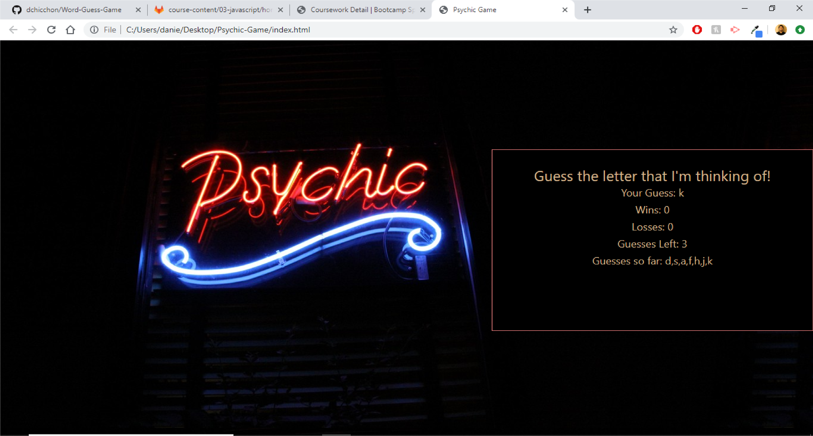

# Word-Guess-Game
## Site Screenshots

## Technologies Used
- [Visual Studio Code](https://code.visualstudio.com/)
- [Git](https://git-scm.com/)
- [GitHub](https://github.com/)
- [Google Chrome](https://www.google.com/chrome/)
- [Meyer Web Reset Page](https://meyerweb.com/eric/tools/css/reset/)

## Summary
The purpose of this homework assignment was to use javascript to create a letter guessing game. The player wins when the letter that they select matches what the computer selects. They have 10 tries to guess the right letter. 

## Steps

1. I structure my html to have tags that indicate number of wins, losses, guesses, and guesses made. I also have a tag that asks the user to pick a letter from the keyboard. 

2. Those html tags have nodes that link with variables in the javascript. So as the variables change in value, it is shown to the player on the browser (number of wins, losses, etc.)

3. Writing in my Javascript, create pointer variables to the nodes in html and variables that represent the values of those pointer variables (wins, losses, guesses left, guesses made). I then created an array called alphabet which is what the computer will select from by specifiying an index. I also instantiate a variable for whatever value the computer selects.

4. I create two functions. Function **reset()** resets the game once the player has either guessed the correct letter or has lost. Resetting the game involves setting the number of guesses back to 10, empties the letters guesssed array, and gets the computer to select a new index from the alphabet array. The second function **checkAlpha()** checks the key pressed by the player. If the player presses a letter within the alphabet, it returns the value true.

5. I set the computer selection variable to the indice in an alphabet that is randomly selected using Math.floor and Math.random().

6. If I press a key on the keyboard, it will begin the game. The key that we pressed will go through checks to make sure its a valid letter to be compared against the value that the computer chose.

7. We will then reach the if statement that checks if the user selection is equal to the computer selection. If true, the user has then met the win condition and increases the win counter by 1. If false, the user's guess count gets dropped by 1. Within that else statement, if the guess count get dropped to 0, the lose counter increases by 1.

8. We also have a reset function for if the user won or lost. The reset function sets the guesses back to 10, empties the letters guessed array, and a newly selected letter by the computer.

## My Links
- [Github](https://github.com/dchicchon)
- [LinkedIn](https://www.linkedin.com/in/danielchicchon/)
